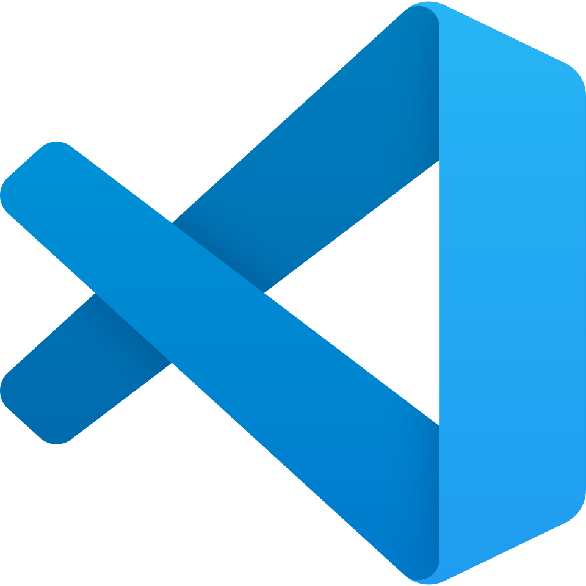
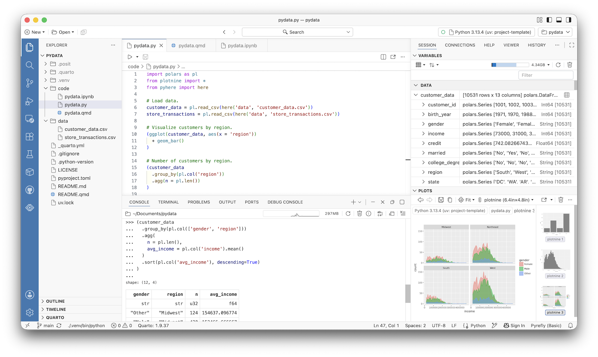
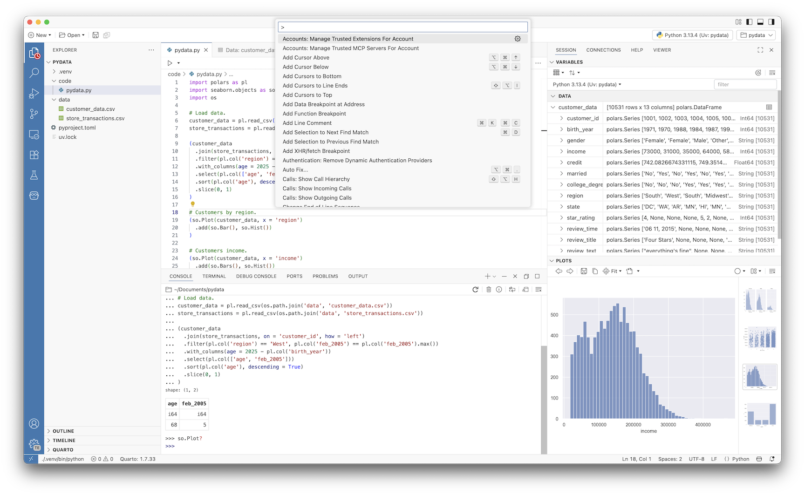

# What is the benefit of learning how to code? Does it  matter in the age of AI? Why Python? {background-color="#288DC2"}

## 

:::: {.columns .v-center}

::: {.column width="40%"}
{fig-align="center"}
:::

::: {.column width="60%"}
::: {.incremental}
- Code is transparent and reproducible
- You are responsible for your code
- Python is a general purpose, open source programming language
- "The second-best language for everything"
- Python is a *big tent*
:::
:::

::::

## {visibility="uncounted"}

:::: {.columns .v-center}

::: {.column width="40%"}
](../figures/logo_monty-python.png){fig-align="left"}
:::

::: {.column width="60%"}
- Code is transparent and reproducible
- You are responsible for your code
- Python is a general purpose, open source programming language
- "The second-best language for everything"
- Python is a *big tent*
:::

::::

# Follow your course instructions

# Code Editors {background-color="#288DC2"}

## 

:::: {.columns .v-center}

::: {.column width="33%" .fragment fragment-index=1}
{fig-align="center"}
:::

::: {.column width="33%"}
{fig-align="center"}
:::

::: {.column width="33%" .fragment fragment-index=2}
{fig-align="center"}
:::

::::

## 

{fig-align="center"}

## 

{fig-align="center"}

## 

:::: {.columns .v-center}

::: {.column width="40%"}
{fig-align="center"}
:::

::: {.column width="60%"}
::: {.incremental}
- Code editors (i.e., IDEs) are an essential tool in the modern tech stack
- VS Code (and its *forks* like Cursor and Positron) are the industry standards
- Integrated GitHub and SSH tools
- Heavy use of the Command Palatte (Cmd/Cntrl+Shift+P)
:::
:::

::::

# Python Environments {background-color="#288DC2"}

## 

{fig-align="center"}

## Managing your Python environment

A Python environment is composed of the **Python version** and **library versions** (including dependencies)

```{python}
#| code-line-numbers: "|1-3|1,3,5-7|2,18-21"

import polars as pl
import seaborn.objects as so
import os

# Load data.
customer_data = pl.read_csv(os.path.join('data', 'customer_data.csv'))
store_transactions = pl.read_csv(os.path.join('data', 'store_transactions.csv'))

(customer_data
  .join(store_transactions, on='customer_id', how='left')
  .filter(pl.col('region') == 'West', pl.col('feb_2005') == pl.col('feb_2005').max())
  .with_columns(age = 2024 - pl.col('birth_year'))
  .select(pl.col(['age', 'feb_2005']))
  .sort(pl.col('age'), descending=True)
  .slice(0, 1)
)

# Customers by region.
(so.Plot(customer_data, x = 'region')
  .add(so.Bar(), so.Hist())
)
```

## Managing your Python environment

A Python environment is composed of the **Python version** and **library versions** (including dependencies) and it is not uncommon for different projects to require **different Python versions** and **different library versions**

::: {.incremental}
- A **virtual environment** (a.k.a., a **project environment**) is a self-contained, project-specific environment
- Project environments can be **reproduced on another machine** by you (including future you) or someone else
- If you need to reproduce something about your machine beyond your code, Python version, and library versions, you'll want to use a **container**
:::

::: {.fragment}
This is part of the reason why in some courses you'll use a **cloud-based solution** (e.g., Google Colab) where the Python environment is managed for you
:::

## 

:::: {.columns .v-center}

::: {.column width="40%"}
{fig-align="center"}
:::

::: {.column width="60%"}
::: {.incremental}
- uv has rapidly emerged as the industry standard for managing Python environments
- A single tool to replace conda, pip, poetry, pyenv, virtualenv, etc.
- Installable via the command line (i.e., the programming interface into your OS itself)
- Integrated with Positron to bootstrap Python installation and environment management
:::
:::

::::

# Python Scripts and Notebooks {background-color="#288DC2"}

## 

{fig-align="center"}

## 

:::: {.columns .v-center}

::: {.column width="33%" .fragment fragment-index=1}
{fig-align="center"}
:::

::: {.column width="33%"}
{fig-align="center"}
:::

::: {.column width="33%" .fragment fragment-index=2}
{fig-align="center"}
:::

::::

## 

:::: {.columns .v-center}

::: {.column width="40%"}
{fig-align="center"}
:::

::: {.column width="60%"}
::: {.incremental}
- Notebooks combine code and markdown, perfect for documenting a process and creating reports
- Jupyter notebooks don't play well with GitHub while Marimo and Quarto do
- Quarto notebooks can be rendered into PDFs, Word documents, presentation slides, etc.
:::
:::

::::

<!-- 

- GitHub
- Data engineering and coding for production
- Brief AI discussion
- More importantly — you have human help! Professors, TAs, ASC, Peers
- Ending slide summarizing, details for 20 min work
  - Skills they don't have to know now, but that they might come across and kind of the big picture/framework for where these tools could be useful
- Final slide promoting ASC Workshops (repeat of this)

-->


## 

:::: {.columns .v-center}

::: {.column width="40%"}
{fig-align="center" width="80%"}
:::

::: {.column width="60%"}
::: {.incremental}
- Club and professional forum to learn/retool
- Global network of chapters
- Workshops vary from beginning to advanced
- Polyglot (Python, Julia, R, etc.)
:::
:::

::::

